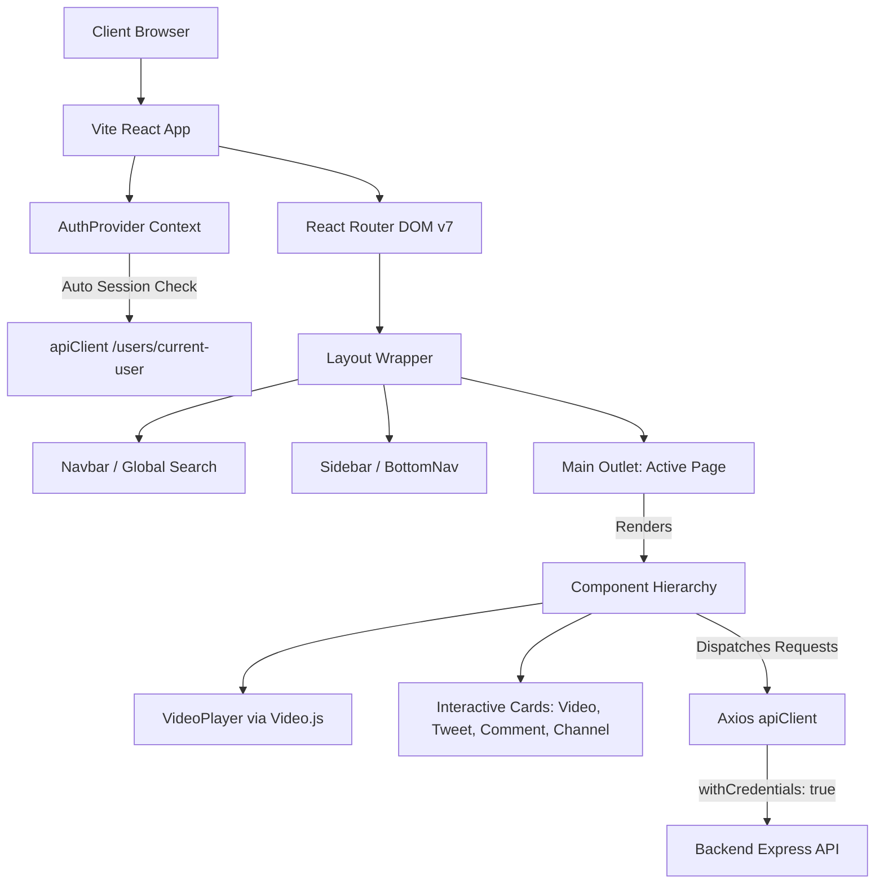

# 💻 JustTube Frontend

[](https://react.dev/)
[](https://vite.dev/)
[](https://tailwindcss.com/)
[](https://reactrouter.com/)
[](https://videojs.com/)
[](https://vercel.com/)

Welcome to **JustTube Frontend**, the premium single-page application (SPA) client built to power a modern hybrid video-streaming and microblogging social platform. Mirroring a YouTube-like media ecosystem and a Twitter-like social networking environment, this client connects seamlessly to the **JustTube Backend API** to deliver a responsive, immersive, and high-fidelity user experience.

The application is built on top of **React** and bootstrapped with **Vite** for blazing-fast developer loops. It features custom streaming layouts using **Video.js**, rapid modern styling via **Tailwind CSS v4.0**, centralized session state using **React Context**, and responsive grid routing using **React Router DOM v7**.

---

## 🚀 Core Features & Frontend Capabilities

*   **🎬 Premium Video Streaming:** Implements a custom **Video.js** player layout supporting play/pause states, volume adjustments, fullscreen modes, buffer tracking, and custom skinning.
*   **🐦 Social Microblogging (Tweets):** Full-featured tweet interaction feed with text and image attachments. Users can post, edit, delete, like, and comment on tweets in real time.
*   **💬 Polymorphic Commenting System:** Double-duty commenting panels that dynamically adjust their API requests based on whether the user is commenting on a video or a tweet.
*   **👍 High-Performance Liking Engine:** Polymorphic toggles allowing immediate, optimistic visual state updates when liking/unliking videos, tweets, or comments.
*   **📁 Custom Playlist Management:** Intuitive dashboard to create, read, update, and delete video playlists. Allows creators to manage video catalogs and toggle visibility settings (`public`, `private`, `unlisted`).
*   **🔔 Follower & Subscription Network:** Dedicated feeds showing recent uploads from subscribed channels, and directories displaying active subscriptions.
*   **📊 Creator Analytics Dashboard:** Displays comprehensive channel-specific metrics, including total video views, subscriber counts, total videos published, total likes, and detailed video management tables.
*   **🔍 Comprehensive Search Suite:** Persistent header search bar supporting dynamic routing. Allows filtering global searches across four indices: Videos, Channels, Tweets, and Playlists.
*   **🛡️ Secure Session Routing:** Integrated auth guard system using custom contexts and cookies (with credentials) to secure private dashboards, uploads, settings, and watch history records.
*   **📱 Responsive Desktop & Mobile Layouts:** Implements responsive side-drawers for desktops and an ergonomic bottom-navigation bar optimized for mobile browsers.

---

## 📐 Client-Side Architecture & Data Flow

The application follows a structured, unidirectional data flow combining React Context for session states, React Router for views, and Axios interceptors for backend communication.



### 🔁 Data Flow Decisions:
1.  **Cookie-Based Session Auth:** The `AuthContext` makes an initial background check to `/users/current-user` on load. Since the backend uses HTTP-only secure cookies, Axios is configured with `withCredentials: true` globally to forward cookies with every API call automatically.
2.  **Infinite Scroll (Intersection Observer):** Pages like `Home` (video feeds) use the HTML5 `IntersectionObserver` API to watch a sentinel `div` at the bottom of the page. This triggers paginated API fetches (`page=N+1`) seamlessly, minimizing manual pagination controls and optimizing browser memory.
3.  **Dynamic Page Layouts:** The main layout is structured around an `<Outlet />` element. Navbar is static at the top, Sidebar is visible on md-screens and above, and BottomNav emerges on mobile viewports.

---

## 📁 Directory Structure

```text
📂 03frontend
 ├── 📂 public/              # Static assets (favicons, logos)
 └── 📂 src/
      ├── 📂 assets/         # Project images, custom icons, and global SVG designs
      ├── 📂 components/     # Reusable UI components (Navbar, Cards, Players, Layouts)
      ├── 📂 context/        # Global React Contexts (AuthContext for session state)
      ├── 📂 pages/          # Complete views mapped to routing paths
      ├── 📂 services/       # Pre-configured Axios API Client instances
      ├── 📄 App.jsx         # Client-side router registry & layouts definition
      ├── 📄 index.css       # Tailwind CSS v4.0 directives & custom dark theme scrollbars
      ├── 📄 main.jsx        # Bootstrapping React root & App mounting
      └── 📄 index.js        # Entrypoint placeholder
```

---

## 🗺️ Page Registry & Routing Map

The frontend maps 22 distinct paths, routing layouts, and pages inside `App.jsx` using `react-router-dom`:

| Page | Route Path | Access Level | Description |
| :--- | :--- | :--- | :--- |
| **Home / Search Feed** | `/` | 🔓 Public | Main landing page listing published videos with infinite scroll. Displays query search results if `?q=...` is present. |
| **Sign In** | `/signin` | 🚪 Guest Only | Authentication page for registered users. |
| **Sign Up** | `/signup` | 🚪 Guest Only | Registration portal supporting multipart form uploads (Avatar & Cover). |
| **Verify Email** | `/verify-email` | 🌐 Public | Submits the 6-digit OTP code to verify and activate newly registered accounts. |
| **Channel Videos** | `/:username/videos` | 🔓 Public | Displays public videos published by a specific channel (username). |
| **Channel Tweets** | `/:username/tweets` | 🔓 Public | Displays all text and image tweets posted by a specific channel. |
| **Channel Playlists**| `/:username/playlists` | 🔓 Public | Catalogs public playlists created by a specific channel. |
| **Watch Video** | `/watch` | 🔓 Optional Auth | Premium video streaming player page, featuring likes, comments, and recommendations. |
| **View Tweet** | `/view` | 🔓 Optional Auth | Focused view of a single tweet, including likes and comment sections. |
| **Open Playlist** | `/playlist` | 🔓 Optional Auth | Displays all videos in a playlist. Owners can delete, rename, or remove videos. |
| **Search Channels** | `/search/channels` | 🔓 Public | Lists channel search results matching `?q=...`. |
| **Search Tweets** | `/search/tweets` | 🔓 Public | Lists tweet search results matching `?q=...`. |
| **Search Playlists** | `/search/playlists` | 🔓 Public | Lists playlist search results matching `?q=...`. |
| **You (Profile/Hub)** | `/you` | 🔒 Private | Creator profile page displaying channel stats and quick settings shortcuts. |
| **Watch History** | `/you/history` | 🔒 Private | Displays the user's personal video watch history with clear/remove operations. |
| **Liked Videos** | `/you/liked-videos` | 🔒 Private | Catalogs all videos liked by the logged-in user. |
| **Post Video** | `/post/video` | 🔒 Private | Multi-part upload panel for creators to publish videos (with title, description, and thumbnail). |
| **Post Tweet** | `/post/tweet` | 🔒 Private | Composer to write text tweets and attach optional images. |
| **Edit Video** | `/edit/video` | 🔒 Private | Panel to modify video details or update thumbnails. |
| **Subscriptions Feed**| `/subscriptions` | 🔒 Private | Aggregate list of videos published by subscribed channels. |
| **Subscribed Channels**| `/subscriptions/channels`| 🔒 Private | Lists all channels the logged-in user is currently subscribed to. |

---

## 🧩 Component Architecture Breakdown

The interface is broken down into modular, highly reusable components utilizing Tailwind CSS v4 styling:

### 🎛️ Navigation & Structural Layouts
*   **`Layout.jsx`:** The core template containing the grid system. Arranges the `Navbar`, desktop `Sidebar`, mobile `BottomNav`, and renders active pages inside a central viewport.
*   **`Navbar.jsx`:** Features the brand identity, an interactive search input (which redirects queries to `/search`), and an authenticated profile button that toggles custom dropdowns.
*   **`Sidebar.jsx`:** Slide-out panel containing deep-linked icons and labels with smooth hover transitions, which dynamically collapses on smaller screens.
*   **`BottomNav.jsx`:** Ergonomic, mobile-first navigation bar positioned at the base of the viewport for easy single-thumb navigation.

### 🖼️ Interactive Media Cards
*   **`VideoCard.jsx`:** Renders a responsive video frame containing thumbnail previews, duration overlays, formatted title/owner text, view counts, and publishing timestamps.
*   **`TweetCard.jsx`:** Displays tweet texts, user details, and optional attached images. Renders interactive polymorphic buttons for liking and replying.
*   **`PlaylistCard.jsx`:** Styled collection card displaying playlist names, descriptions, ownership info, and total videos index badge.
*   **`CommentCard.jsx`:** Handles individual comments. Renders the commenter's avatar, timestamp, like counter, and features edit and delete options for the comment owner.

### ⚙️ Systems & Players
*   **`VideoPlayer.jsx`:** Encapsulates the **Video.js** instance, ensuring clean component mounting/unmounting, initializing streaming controls, and exposing hooks for player state changes.
*   **`VideoComments.jsx` & `TweetComments.jsx`:** Dedicated comment controller components that handle loading states, paging, and CRUD actions for their respective platforms.
*   **`Dashboard.jsx`:** The creator hub dashboard, displaying analytics metrics cards (total views, likes, subscribers) alongside video management tables.

---

## 🛠️ Step-by-Step Installation & Local Setup

### ⚙️ Prerequisites
*   [Node.js](https://nodejs.org/) (v20.0.0 or higher recommended)
*   [Running Backend API Service](https://github.com/Archisman2006/Backend-Project.git) (Make sure your backend is up and running, as this client depends on it to fetch data).

### 🛠️ Local Development Installation

1.  **Clone the Repository:**
    ```bash
    git clone https://github.com/Archisman2006/JustTube-frontEnd.git
    cd JustTube-frontEnd
    ```

2.  **Install Dependencies:**
    ```bash
    npm install
    ```

3.  **Configure Environment Variables:**
    Create a `.env` file in the root directory of the project:
    ```env
    VITE_API_BASE_URL=http://localhost:8000/api/v1
    ```
    *(Ensure the port matches the port your backend is running on, usually `8000`).*

4.  **Launch Dev Server:**
    Run the application in local development mode with hot-reloading enabled:
    ```bash
    npm run dev
    ```
    The console will display the local URL:
    ```text
      VITE v5.4.2  ready in 234 ms

      ➜  Local:   http://localhost:5173/
      ➜  Network: use --host to expose
    ```
    Open your browser and navigate to `http://localhost:5173` to interact with the client.

5.  **Build for Production:**
    Compile the assets into a highly optimized and minified production bundle inside the `/dist` folder:
    ```bash
    npm run build
    ```

6.  **Preview Production Build:**
    Preview the compiled production bundle locally:
    ```bash
    npm run preview
    ```

---

## ☁️ Production Deployment (via Vercel)

This client is fully pre-configured to deploy seamlessly to **Vercel** as a Single Page Application (SPA).

1.  **Single Page App Rewrites (`vercel.json`):**
    To prevent routing errors (e.g., `404 Not Found` when refreshing deep links like `/archisman/videos`), the `vercel.json` file redirects all traffic to `index.html`, allowing React Router to handle page updates:
    ```json
    {
      "rewrites": [
        {
          "source": "/(.*)",
          "destination": "/index.html"
        }
      ]
    }
    ```

2.  **Deployment Steps:**
    *   Push your code to GitHub.
    *   Import the repository into the **Vercel Dashboard**.
    *   In the **Project Settings**, add the environment variable:
        *   `VITE_API_BASE_URL` = `https://your-backend-domain.com/api/v1`
    *   Click **Deploy**. Vercel will automatically run `npm run build` and host the compiled SPA.

---

## ⚙️ Technology Stack & Dependencies

*   **Runtime/Framework:** [React v18/v19](https://react.dev/) & [Vite](https://vite.dev/)
*   **Router:** [React Router DOM v7](https://reactrouter.com/) (Declarative client routing)
*   **Styling:** [Tailwind CSS v4.0](https://tailwindcss.com/) (Modern compiled engine and CSS-first config)
*   **HTTP Client:** [Axios v1.16](https://axios-http.com/) (Pre-configured `apiClient` with cookie forwarding)
*   **Media Player:** [Video.js v8.23](https://videojs.com/) (Robust HTML5 video player integration)
*   **Form Management:** [React Hook Form v7.77](https://react-hook-form.com/) (Performant form validation)
*   **Icons:** [Lucide React v1.17](https://lucide.dev/) (Modern and sleek SVG icons)
